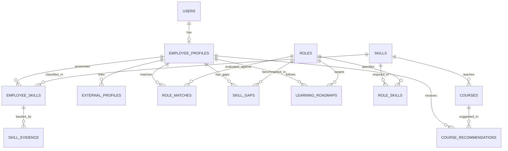

# Database Schema Reference

The platform schema is designed with PostgreSQL and SQLAlchemy 2.0.

## Entity Details

### 1. `users`
- `id` (INTEGER, PK): Unique user identifier.
- `email` (VARCHAR(255), UNIQUE, INDEX): Login email address.
- `password_hash` (VARCHAR(255)): Bcrypt password hash.
- `full_name` (VARCHAR(255)): User's display name.
- `role` (VARCHAR(20)): User system role (`admin`, `hr`, `employee`).
- `is_active` (BOOLEAN): Account status indicator.
- `created_at`, `updated_at` (DATETIME): Audit timestamps.

### 2. `employee_profiles`
- `id` (INTEGER, PK): Primary key.
- `user_id` (INTEGER, FK -> `users.id`, UNIQUE): Linked user account.
- `employee_code` (VARCHAR(40), UNIQUE, INDEX): Internal company employee identifier (e.g. `EMP001`).
- `department` (VARCHAR(100), INDEX): Department (e.g. `Engineering`, `Data`, `Product`).
- `designation` (VARCHAR(100)): Job title (e.g. `Software Engineer`).
- `years_of_experience` (FLOAT): Total work experience.
- `education` (VARCHAR(255)): Academic degrees / universities.
- `location` (VARCHAR(100)): Work location / city.
- `bio` (TEXT): Professional background summary.
- `resume_url` (VARCHAR(500)): Stored resume file URL.
- `profile_completion` (INTEGER): Profile completeness percentage (0-100).
- `created_at`, `updated_at` (DATETIME): Audit timestamps.

### 3. `skills`
- `id` (INTEGER, PK): Primary key.
- `name` (VARCHAR(100), UNIQUE, INDEX): Standardized skill name (e.g. `Python`, `FastAPI`).
- `category` (VARCHAR(100), INDEX): Domain category (e.g. `Backend Engineering`, `Data & AI`).
- `description` (TEXT): Detailed description of skill scope.

### 4. `employee_skills`
- `id` (INTEGER, PK): Primary key.
- `employee_id` (INTEGER, FK -> `employee_profiles.id`): Associated employee profile.
- `skill_id` (INTEGER, FK -> `skills.id`): Standardized skill.
- `proficiency` (INTEGER): Proficiency level (1 to 5).
- `confidence` (FLOAT): System confidence score (0.0 to 1.0).
- `skill_type` (VARCHAR(30)): Skill categorization (`explicit`, `inferred`, `transferable`).
- `source` (VARCHAR(100)): Acquisition origin (`self-reported`, `peer-review`, `ai-extracted`).
- `created_at`, `updated_at` (DATETIME): Audit timestamps.

### 5. `skill_evidence`
- `id` (INTEGER, PK): Primary key.
- `employee_skill_id` (INTEGER, FK -> `employee_skills.id`): Target employee skill.
- `source_type` (VARCHAR(100)): Source type (e.g. `github-pr`, `project-deliverable`, `certification`).
- `source_reference` (VARCHAR(255)): URL or identifier to artifact.
- `evidence_text` (TEXT): Extracted evidence snippet or justification.
- `confidence` (FLOAT): Evidence confidence level.
- `created_at` (DATETIME): Creation timestamp.

### 6. `roles`
- `id` (INTEGER, PK): Primary key.
- `title` (VARCHAR(120), INDEX): Role title (e.g. `Senior Software Engineer`).
- `department` (VARCHAR(100), INDEX): Department domain.
- `description` (TEXT): Role responsibilities overview.
- `level` (VARCHAR(60)): Experience level (e.g. `Junior`, `Mid-Level`, `Senior`, `Lead`).
- `is_active` (BOOLEAN): Status flag.

### 7. `role_skills`
- `id` (INTEGER, PK): Primary key.
- `role_id` (INTEGER, FK -> `roles.id`): Target role.
- `skill_id` (INTEGER, FK -> `skills.id`): Required skill.
- `required_proficiency` (INTEGER): Minimum expected proficiency level (1-5).
- `importance` (VARCHAR(30)): Skill weight (`critical`, `high`, `medium`, `nice-to-have`).

### 8. `role_matches`
- `id` (INTEGER, PK): Primary key.
- `employee_id` (INTEGER, FK -> `employee_profiles.id`): Target candidate.
- `role_id` (INTEGER, FK -> `roles.id`): Benchmarked role.
- `match_score` (FLOAT): Overall match percentage (0.0 - 100.0).
- `matching_skills` (JSON): Array of satisfied skill criteria.
- `missing_skills` (JSON): Array of missing/insufficient skills.
- `explanation` (TEXT): Explainable matching rationale.
- `created_at`, `updated_at` (DATETIME): Timestamps.

### 9. `skill_gaps`
- `id` (INTEGER, PK): Primary key.
- `employee_id` (INTEGER, FK -> `employee_profiles.id`): Employee.
- `role_id` (INTEGER, FK -> `roles.id`): Target role.
- `skill_id` (INTEGER, FK -> `skills.id`): Gap skill.
- `current_proficiency` (INTEGER): Current level.
- `required_proficiency` (INTEGER): Required level.
- `gap_level` (VARCHAR(30)): Severity (`none`, `low`, `medium`, `high`, `critical`).
- `created_at` (DATETIME): Timestamp.

### 10. `courses`
- `id` (INTEGER, PK): Primary key.
- `title` (VARCHAR(255)): Course name.
- `provider` (VARCHAR(100), INDEX): Course platform (Coursera, Udemy, edX, Pluralsight).
- `description` (TEXT): Course overview.
- `skill_id` (INTEGER, FK -> `skills.id`, NULLABLE): Targeted skill.
- `difficulty` (VARCHAR(50)): Beginner, Intermediate, Advanced.
- `duration` (VARCHAR(50)): Estimated duration.
- `url` (VARCHAR(500)): Course web link.
- `is_active` (BOOLEAN): Status flag.

### 11. `course_recommendations`
- `id` (INTEGER, PK): Primary key.
- `employee_id` (INTEGER, FK -> `employee_profiles.id`): Recommended candidate.
- `course_id` (INTEGER, FK -> `courses.id`): Recommended course.
- `reason` (TEXT): Personalized recommendation reason.
- `priority` (VARCHAR(30)): Priority (`high`, `medium`, `low`).
- `created_at` (DATETIME): Timestamp.

### 12. `learning_roadmaps`
- `id` (INTEGER, PK): Primary key.
- `employee_id` (INTEGER, FK -> `employee_profiles.id`): Employee.
- `target_role_id` (INTEGER, FK -> `roles.id`, NULLABLE): Target milestone role.
- `roadmap_data` (JSON): Multi-phase structured milestone curriculum.
- `created_at`, `updated_at` (DATETIME): Timestamps.

### 13. `external_profiles`
- `id` (INTEGER, PK): Primary key.
- `employee_id` (INTEGER, FK -> `employee_profiles.id`): Employee.
- `platform` (VARCHAR(50), INDEX): `github`, `linkedin`, `lms`, `competitive`, `other`.
- `profile_url` (VARCHAR(500)): Profile link.
- `username` (VARCHAR(100)): Handle / username.
- `raw_data` (JSON): Metadata payload.
- `created_at`, `updated_at` (DATETIME): Timestamps.
